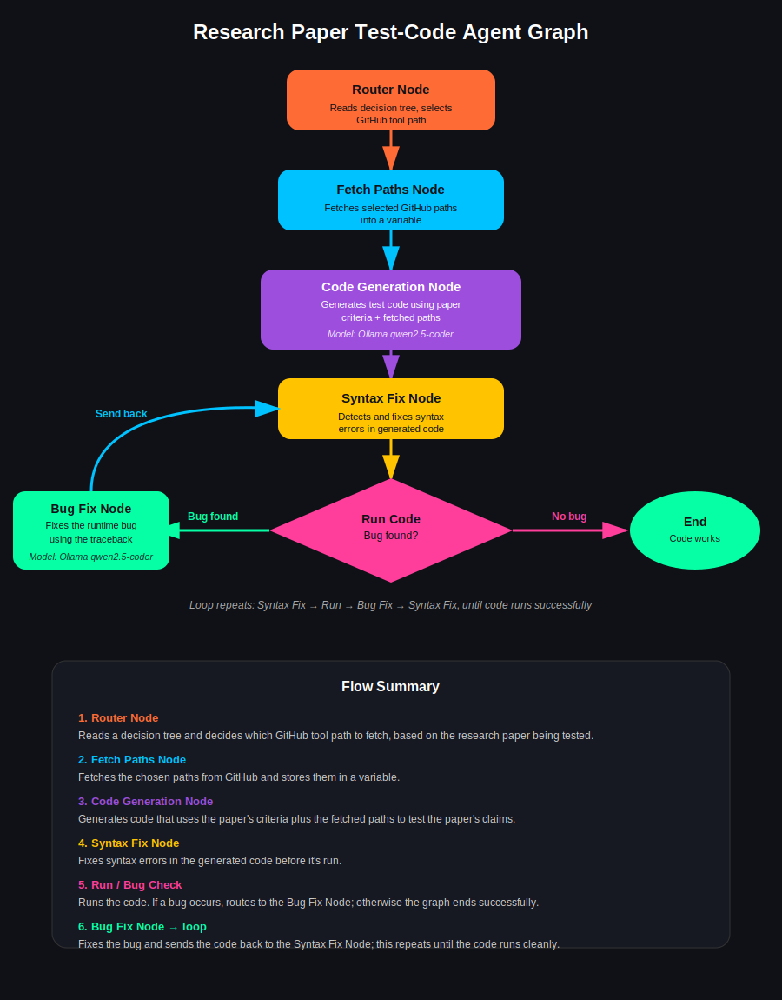

# Arvix_research_agent

This repo aims to analyze research papers based on a user prompt on what
wants to be researched. Once the papers are read in from arxiv, AI Agents (Ollama and Gemini)
determine the relevance of each papers and generates summaries assessing each paper.
The result is then stored into a yaml file under the saved_papers folder. Afterwards, test_strategy.py
automatically generates code to backtest the strategy outlined in the papers to test the validity of the
claim and backtest out sample and provide plots of portfolio.

The following packages are needed:
python-dotenv
langchain-core
langchain-google-genai
langchain-ollama
langgraph
arxiv
pymupdf
requests
pyyaml
ollama
numpy
vectorbt
gitingest

The Ollama models llama3.2 and qwen2.5-coder need to be downloaded to excecute the test_strategy script

Additionally, a Gemini, OpenAlex, and Alpaca API key is necessary

To Fetch papers and process them run:

> [!NOTE]
> Run this command to fetch the papers:
> ```bash
> python3 read_papers.py
> ```

> [!NOTE]
> Run this command to generate code to backtest papers:
> ```bash
> python3 test_strategy.py
> ```

The diagram of the agent workflow is noted below


